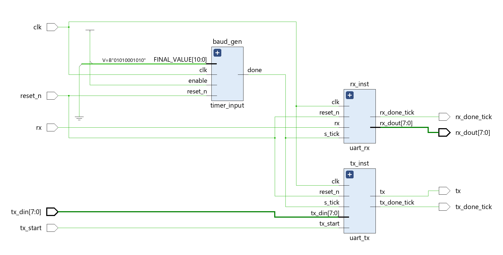
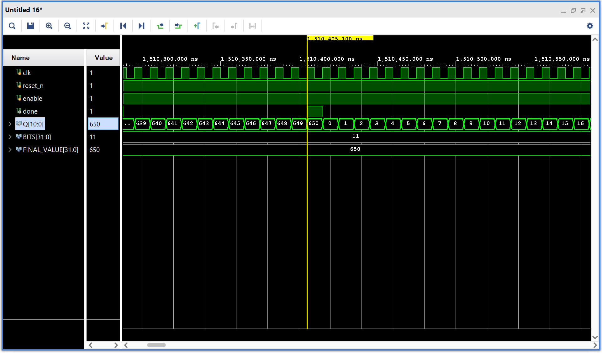
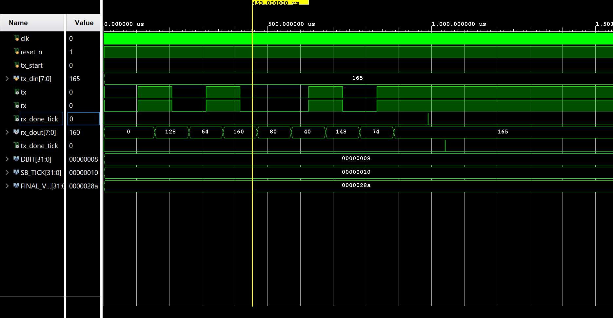

# UART Communication Protocol (8-bit)

This project implements a complete **UART communication protocol** in **behavioral Verilog**. It features a **baud rate generator**, **transmitter**, and **receiver**, all coordinated using finite state machines (FSMs). The design supports configurable frame formats and oversampling for robust serial data communication.

---

## Schematic

---

## Description

- **Frame Format** (configurable):  
  - 1 Start bit  
  - 8 Data bits  
  - 1 Stop bit

- **Baud Rate**:  
  - 9500 baud  
  - Baud rate generator produces an `s_tick` every 650 clock cycles (16× oversampling)

- **Oversampling**:  
  - Each bit is sampled 16 times to ensure stable data reception and accurate synchronization

---

## Design Approach

- Implemented entirely using **behavioral Verilog**
- Each module is designed using a clean **finite state machine (FSM)** approach
- FSMs govern:
  - Bit-level transmission sequencing in the **transmitter**
  - Start detection, sampling, and reassembly in the **receiver**
  - Counting and tick assertion in the **baud rate generator**

---

## Modules

### Baud Rate Generator

- **Function**: Provides timing pulses for UART modules
- **Mechanism**: A counter increments from 0 to 649. When it reaches 649, it resets and asserts a single-cycle `s_tick`.
- **Verification**:
  - Simulated using **Vivado**
  - Output waveform confirms a clean `s_tick` pulse after every 650 cycles
  - Confirms accurate timing for 9500 baud with 16× oversampling

#### Output Waveform

---

### Transmitter (TX)

- **Inputs**:  
  - `tx_din`: 8-bit parallel input  
  - `tx_start`: pulse signal to start transmission
- **Operation**:
  - FSM-driven sequence emits start bit, data bits (LSB first), and stop bit
  - Uses `s_tick` to control bit timing
  - Asserts `tx_done_tick` upon frame completion

---

### Receiver (RX)

- **Input**: Serial line `rx`
- **Operation**:
  - Waits for falling edge (start bit)  
  - Uses 16× `s_tick` sampling to lock onto bit center  
  - FSM steps through 8 data bits and checks stop bit  
  - Outputs byte on `rx_dout`, and asserts `rx_done_tick` after valid frame

---

## Output Verification

- All modules tested via **Vivado simulations**
- **Transmitter and receiver** verified using waveform matching with expected UART sequences
- **Baud generator** confirmed via:
  - Count tracking from 0 to 649
  - Assertion of `s_tick` precisely at 650th cycle

---

## Output Waveform

---

## FPGA Implementation Status

- **Not yet implemented on hardware**
- Future plan:
  - Use **two Basys 3 boards**:
    - Board 1: Transmitter + Baud Generator
    - Board 2: Receiver + Baud Generator
  - Connect `tx` of one board to `rx` of the other

---

## Notes

- Fully **behavioral Verilog** design
- Uses FSMs for all module control flow
- Frame length, oversampling ratio, and timing are configurable
- Extensible for parity, custom frame sizes, and buffering

